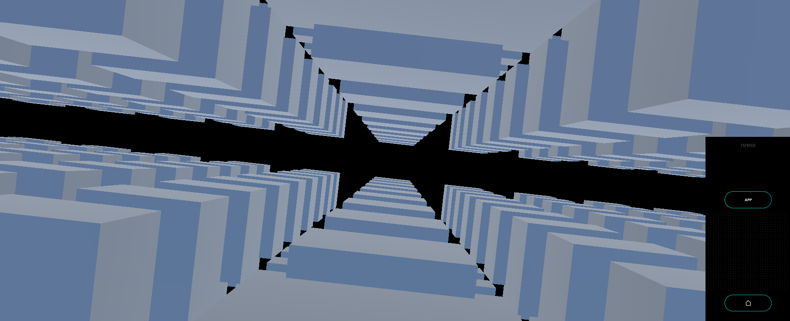

# Check size of a lot of cubes on Nreal light - MR Tutorial for Nreal light



This sample is to see what size you can actually feel by placing many 1x1x1 cubes in the space.

## Sample Repository

- [mr\-tutorials\-for\-nreal\-light/CubeSize at main · karad/mr\-tutorials\-for\-nreal\-light](https://github.com/karad/mr-tutorials-for-nreal-light/tree/main/CubeSize)

## Run the sample

1. Clone Sample Repository, Change current directory to `CubeSize` . And Open with Unity.
2. (If you don't have NRSDK) Download NRSDK 1.7.0 from [https://nreal-public.nreal.ai/download/NRSDKForUnityAndroid_1.7.0.unitypackage](https://nreal-public.nreal.ai/download/NRSDKForUnityAndroid_1.7.0.unitypackage)
3. Open `Build Setting`, change Platform to `Android`
4. Open `Project`, select `Assets` > `import package` > `Custom Package` and import `NRSDKForUnityAndroid_1.7.0.unitypackage`.
5. Check `Build Settings` > `Player Settings` by referring to [Configure Build Settings](https://nreal.gitbook.io/nrsdk-documentation/discover/quickstart-for-android#configure-build-settings)
6. Press `Build` form `Build Settings` panel
7. Install *.apk on Android or DevKit.

## Tutorial

### 1. Setting up the project for Nreal development

1. See [Quickstart for Android - NRSDK Documentation](https://nreal.gitbook.io/nrsdk-documentation/discover/quickstart-for-android#configure-build-settings) and configure the build settings.
2. (If you don't have NRSDK) Download NRSDK 1.7.0 from [https://nreal-public.nreal.ai/download/NRSDKForUnityAndroid_1.7.0.unitypackage](https://nreal-public.nreal.ai/download/NRSDKForUnityAndroid_1.7.0.unitypackage)
3. Open `Project`, select `Assets` > `import package` > `Custom Package` and import `NRSDKForUnityAndroid_1.7.0.unitypackage`.

### 2. Put a Cube in the scene and convert it to Prefab

1. Open `Project` , create `Resource` folder in `Assets` > `Scenes`
2. Create `Cube` on current scene, change name to `MyCube` . 
3. Drag `MyCube` to `Assets` > `Scenes` > `Resource` folder.
4. Delete `MyCube` from `Hierarchy` .

### 3. Create an empty GameObject and attach C# script to it.

1. Create an empty GameObject on `Hierarchy` with the name `BaseCubeSize` .
2. Create the following C# script named `CubeSize` and attach it to the empty GameObject you just created.

```csharp
using System.Collections;
using System.Collections.Generic;
using UnityEngine;
using UnityEngine.EventSystems;

public class CubeSize : MonoBehaviour
{
    /// <summary>
    /// Cube PreFab
    /// </summary>
    GameObject spherePrefab;

    /// <summary>
    /// Initial Position for cube layout
    /// </summary>
    static readonly Vector3 INITIAL_POSITION = new Vector3(0.0f, -0.35f, 3f);

    /// <summary>
    /// Number of Cubes list per axis
    /// </summary>
    static readonly float DEPTH = 20f;

    /// <summary>
    /// Space for each Cubes
    /// </summary>
    static readonly float SPAN = 2f;

    // Start is called before the first frame update
    void Start()
    {
        spherePrefab = Resources.Load<GameObject>("MyCube");
        LayoutCubes(DEPTH, SPAN);
    }

    /// <summary>
    /// Layout Cubes
    /// </summary>
    /// <param name="depth"></param>
    /// <param name="span"></param>
    void LayoutCubes(float depth, float span)
    {
        for (float x = -depth; x <= depth; x = x += span)
        {
            for (float y = -depth; y <= depth; y += span)
            {
                for (float z = -depth; z <= depth; z += span)
                {
                    // Exclude own position
                    if (!(x == 0 && y == 0 && z == -2f))
                    {
                        CreateCube(x, y, z);
                    }
                }
            }
        }
    }

    /// <summary>
    /// Put a cube  in the current scene
    /// </summary>
    /// <param name="x"></param>
    /// <param name="y"></param>
    /// <param name="z"></param>
    void CreateCube(float x, float y, float z)
    {
        GameObject sphere = Instantiate(spherePrefab);
        sphere.transform.position = new Vector3(INITIAL_POSITION.x + x, INITIAL_POSITION.y + y, INITIAL_POSITION.z + z);
    }
}
```

### 4. Build

1. Press `Build` form `Build Settings` panel
2. Install *.apk on Android or DevKit.