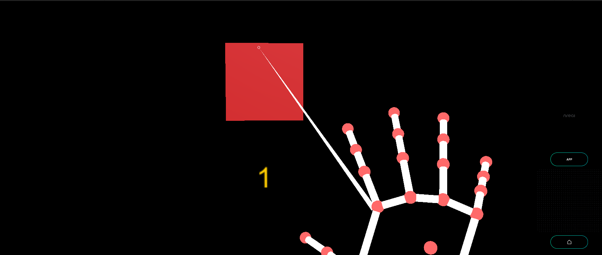

# HandTracking - MR Tutorial for Nreal light

Simple HandTracking tutorial. Use hand tracking to pinch to increase the count!



## Sample Repository

- [mr\-tutorials\-for\-nreal\-light/HandTracking at main · karad/mr\-tutorials\-for\-nreal\-light](https://github.com/karad/mr-tutorials-for-nreal-light/tree/main/HandTracking)

## Run the sample

1. Clone Sample Repository, Change current directory to `HandTracking` . And Open with Unity.
2. (If you don't have NRSDK) Download NRSDK 1.7.0 from [https://nreal-public.nreal.ai/download/NRSDKForUnityAndroid_1.7.0.unitypackage](https://nreal-public.nreal.ai/download/NRSDKForUnityAndroid_1.7.0.unitypackage)
3. Open `Build Setting`, change Platform to `Android`
4. Open `Project`, select `Assets` > `import package` > `Custom Package` and import `NRSDKForUnityAndroid_1.7.0.unitypackage`.
5. Check `Build Settings` > `Player Settings` by referring to [Configure Build Settings](https://nreal.gitbook.io/nrsdk-documentation/discover/quickstart-for-android#configure-build-settings)
6. Press `Build` form `Build Settings` panel
7. Install *.apk on Android or DevKit.

## Tutorial

### 1. Setting up the project for Nreal development

1. See [Quickstart for Android - NRSDK Documentation](https://nreal.gitbook.io/nrsdk-documentation/discover/quickstart-for-android#configure-build-settings) and configure the build settings.
2. (If you don't have NRSDK) Download NRSDK 1.7.0 from [https://nreal-public.nreal.ai/download/NRSDKForUnityAndroid_1.7.0.unitypackage](https://nreal-public.nreal.ai/download/NRSDKForUnityAndroid_1.7.0.unitypackage)
3. Open `Project`, select `Assets` > `import package` > `Custom Package` and import `NRSDKForUnityAndroid_1.7.0.unitypackage`.

### 2. Setting for HandTracking to NRInput

1. Select `NRInput` , and change `Input Source Type` to `Hands`
2. Put `NRHand_R` from `Assets` > `NRSDK` > `Prefabs` > `Hands` to `NRInput` > `Right`
3. Put `NRHand_L` from `Assets` > `NRSDK` > `Prefabs` > `Hands` to `NRInput` > `Left`

### 3. Create Material

1. Open `Project`, select `Assets` 
2. Create `Material` on `Assets`
    1. Change name to “TouchCubeMaterial”
    2. Change `Albedo` to “CC0000”

### 4. Put Cube in the Scene

1. Put `Cube` in the Scene
    1. Change name to “TouchCube”
    2. `Pos X` : 0, `Pos Y` : 0, `Pos Z` : 8

### 5. Put a Canvas in the scene

1. Put `Canvas` from `Create` > `UI`
2. Set property on `Inspector` panel
    1. `Render Mode` : World Space
    2. `Pos X` : 0 , `Pos Y` : -0.35 `Pos Z` : 3
    3. `Scale`
        1. `X` : 0.005 , `Y` : 0.005 , `Z` : 0.005

### 6. Put Text in Canvas

1. Put `Text` as a child of `Canvas` with the name "Counter”.
    1. `Pos X` : 0, `Pos Y` : -30, `Pos Z` : 3
    2. Change `Text` to “0”
    3. Change `Color` to “FFCC00”
    4. Change Font size to 30

### 7. Create C# Script in Assets

1. Create `C# Script` in the asset with the file name "HandTrack.cs".
2. Write the code as follows

```csharp
using System.Collections;
using System.Collections.Generic;
using UnityEngine;
using UnityEngine.EventSystems;
using UnityEngine.UI;

public class HandTrack : MonoBehaviour, IPointerClickHandler
{
    /// <summary>
    /// Counter Text GameObject
    /// </summary>
    public Text targetText;

    /// <summary>
    /// Counter value
    /// </summary>
    private int counter = 0;

    /// <summary>
    /// HandTracking Click Handler
    /// </summary>
    /// <param name="eventData"></param>
    public void OnPointerClick(PointerEventData eventData)
    {
        counter++;
        targetText.text = counter.ToString();
        //throw new System.NotImplementedException();
    }

    // Start is called before the first frame update
    void Start()
    {

    }

    // Update is called once per frame
    void Update()
    {

    }
}
```

### 8. Attach the C# script on “TouchCube”

1. Attach "HandTrack.cs" to “TouchCube”
    1. Set `Target Text` on `Inspector` panel to `Counter` on the scene.

### 9. Build

1. Press `Build` form `Build Settings` panel
2. Install *.apk on Android or DevKit.


