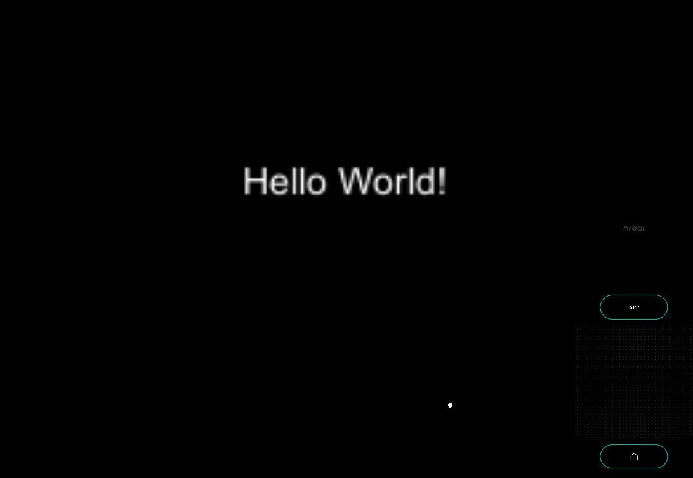

# Hello World - MR Tutorial for Nreal light

## Sample Repository

- [mr\-tutorials\-for\-nreal\-light/HelloWorld at main · karad/mr\-tutorials\-for\-nreal\-light](https://github.com/karad/mr-tutorials-for-nreal-light/tree/main/HelloWorld)

## Run the sample

1. Clone Sample Repository, Change current directory to `HelloWorld`. And Open with Unity.
2. (If you don't have NRSDK) Download NRSDK 1.7.0 from [https://nreal-public.nreal.ai/download/NRSDKForUnityAndroid_1.7.0.unitypackage](https://nreal-public.nreal.ai/download/NRSDKForUnityAndroid_1.7.0.unitypackage)
3. Open `Build Setting`, change Platform to `Android`
4. Open `Project`, select `Assets` > `import package` > `Custom Package` and import `NRSDKForUnityAndroid_1.7.0.unitypackage`.
5. Check `Build Settings` > `Player Settings` by referring to [Configure Build Settings](https://nreal.gitbook.io/nrsdk-documentation/discover/quickstart-for-android#configure-build-settings)
6. Press `Build` form `Build Settings` panel
7. Install *.apk on Android or DevKit.

## Tutorial

### 1. Setting up the project for Nreal development

1. See [Quickstart for Android - NRSDK Documentation](https://nreal.gitbook.io/nrsdk-documentation/discover/quickstart-for-android#configure-build-settings) and configure the build settings.
2. (If you don't have NRSDK) Download NRSDK 1.7.0 from [https://nreal-public.nreal.ai/download/NRSDKForUnityAndroid_1.7.0.unitypackage](https://nreal-public.nreal.ai/download/NRSDKForUnityAndroid_1.7.0.unitypackage)
3. Open `Project`, select `Assets` > `import package` > `Custom Package` and import `NRSDKForUnityAndroid_1.7.0.unitypackage`.

### 2. Put a Canvas in the scene

1. Put `Canvas` from `Create` > `UI`
2. Set property on `Inspector` panel
    1. `Render Mode` : World Space
    2. `Pos X` : 0 , `Pos Y` : -0.35 `Pos Z` : 3
    3. `Scale`
        1. `X` : 0.005 , `Y` : 0.005 , `Z` : 0.005

### 3. Put Text in Canvas

1. Put `Text` as a child of `Canvas`
    1. `Pos X` : 0, `Pos Y` : 50, `Pos Z` : 3
2. Change Text to "Hello World!" on Inspector panel.

### 4. Build

1. Press `Build` form `Build Settings` panel
2. Install *.apk on Android or DevKit.

