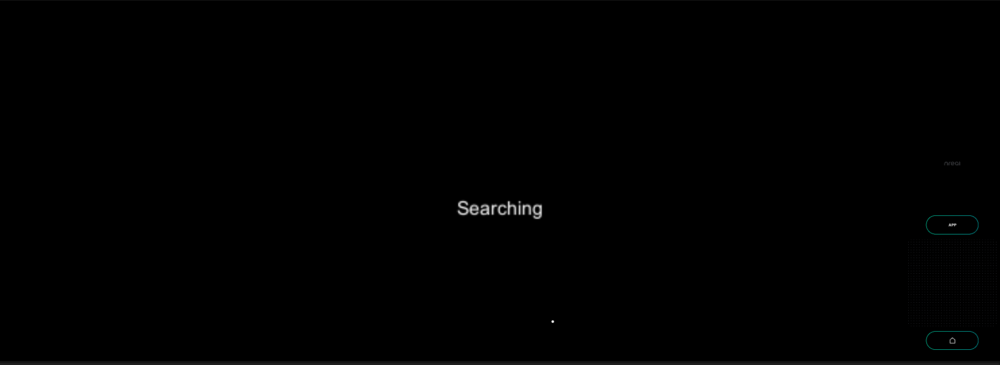

# Images and words (Sample of image detection) - MR Tutorial for Nreal Light



This sample displays the message "Detected" when the prepared image comes into view. Learn how to detect images by creating a very simple sample.

## Sample Repository

- [mr\-tutorials\-for\-nreal\-light/ImagesAndWords at main · karad/mr\-tutorials\-for\-nreal\-light](https://github.com/karad/mr-tutorials-for-nreal-light/tree/main/ImagesAndWords)

## Run the sample

1. Clone sample repository, Change current directory to `ImagesAndWords`. And Open with Unity.
2. (If you don’t have NRSDK) Download NRSDK 1.7.0 from [https://nreal-public.nreal.ai/download/NRSDKForUnityAndroid_1.7.0.unitypackage](https://nreal-public.nreal.ai/download/NRSDKForUnityAndroid_1.7.0.unitypackage)
3. Open `Build Setting`, change Platform to `Android`
4. Open `Project`, select `Assets` > `import package` > `Custom Package` and import `NRSDKForUnityAndroid_1.7.0.unitypackage`.
5. Check `Build Settings` > `Player Settings` by referring to [Configure Build Settings](https://nreal.gitbook.io/nrsdk-documentation/discover/quickstart-for-android#configure-build-settings)
6. Press `Build` form `Build Settings` panel
7. Install *.apk on Android or DevKit.

## Tutorial

### 1. Setting up the project for Nreal development

1. See [Quickstart for Android - NRSDK Documentation](https://nreal.gitbook.io/nrsdk-documentation/discover/quickstart-for-android#configure-build-settings) and configure the build settings.
2. (If you don’t have NRSDK) Download NRSDK 1.7.0 from [https://nreal-public.nreal.ai/download/NRSDKForUnityAndroid_1.7.0.unitypackage](https://nreal-public.nreal.ai/download/NRSDKForUnityAndroid_1.7.0.unitypackage)
3. Open `Project`, select `Assets` > `import package` > `Custom Package` and import `NRSDKForUnityAndroid_1.7.0.unitypackage`.

### 2. Prepare tracking images

Prepare a sample image for image detection. Multiple images can be set for image detection. The sample is provided as an image named “ImageDetect.png”. 

1. Put it to `Assets` > `Scene` .

### 3. Create TrackingImageDatabase

Image detection requires a database with registered images for image detection.

1. Select yout tracking Images, and display context menu with right click. 
2. Select `Create` > `NRSDK` > `TrackingImageDatabase` . Then a `TrackingImageDatabase` will be created.

### 4. Create SessionConfig

Register the database you just created in SessionConfig.

1. Move to `Assets` > `Scene` , and select  `Create` > `NRSDK` > `SessionConfig` then create SessionConfig.
2. Select the `NRKernalSessionConfig` you just created and open `Inspector` .
3. Enable `Image Tracking Mode` .
4. Drag  `TrackingImageDatabase` to `Tracking Image Database` 

### 5. Set SessionConfig to NRCameraRig

The place to register `SessionConfig` is in `NRCameraRig`.

1. Select  `Hierarchy` > `NRCameraRig` 
2. Drag `NRKernalSessionConfig` to `Session Config`  on `Inspector` > `NR Session Behaviour` 

### 6. Create C# Script for image detection

1. Create `C# Script` in the asset with the file name "IconDetect.cs". Write the code as follows.

```csharp
using NRKernal;
using NRKernal.NRExamples;
using System.Collections;
using System.Collections.Generic;
using UnityEngine;
using UnityEngine.UI;

/// <summary>
/// Icon Detect class using Trackable Images
/// </summary>
public class IconDetect : MonoBehaviour
{
    /// <summary>
    /// Trackable image list
    /// </summary>
    private List<NRTrackableImage> m_NewMarkers = new List<NRTrackableImage>();

    /// <summary>
    /// Display trackable status
    /// </summary>
    public Text text;

    // Start is called before the first frame update
    void Start()
    {
        text.text = "Searching";
    }

    // Update is called once per frame
    void Update()
    {
        NRFrame.GetTrackables<NRTrackableImage>(m_NewMarkers, NRTrackableQueryFilter.New);

        if(m_NewMarkers.Count > 0)
        {
            NRTrackableImage image = m_NewMarkers[0];
            Debug.Log(image.GetCenterPose().ToString());
            // If you use NRAnchor, uncomment the following
            // NRAnchor anchor = image.CreateAnchor();
            text.text = "Detected";
        }
    }
}
```

### 7. Put Canvas and Text on the scene

Put `Text` object for displaying the cube rotation value.

1. Put `Canvas` from `Create` > `UI`
2. Put `Text` as a child of `Canvas`
3. Change Text to “Info” on `Inspector` panel.
4. Attach `IconDetect.cs` on `Inspector` panel of `Canvas`.
5. Set `Text` to `Text` Text Object.

### 8. Build

1. Press `Build` form `Build Settings` panel
2. Install *.apk on Android or DevKit.

### 9. Test your application by displaying images for image detection

Display the image for image detection on your own smartphone or PC and view the image in Nreal Light. Make sure the text displayed in Nreal Light goes from Searching to Detected.