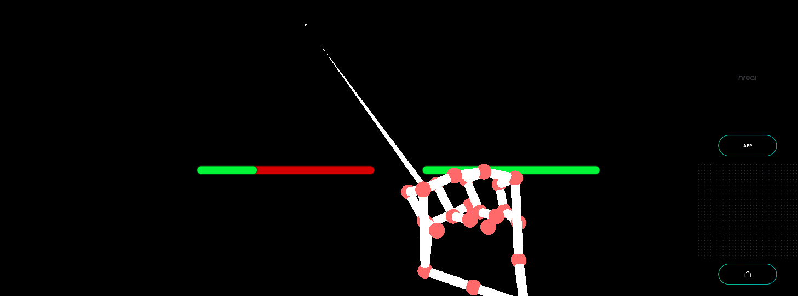

# Pinch Strength using HandTracking - MR Tutorial for Nreal light



Measure the strength of your left and right hand hand tracking.

## Sample Repository

- [mr\-tutorials\-for\-nreal\-light/PinchStrength at main · karad/mr\-tutorials\-for\-nreal\-light](https://github.com/karad/mr-tutorials-for-nreal-light/tree/main/PinchStrength)

## Run the sample

1. Clone Sample Repository, Change current directory to `PinchStrength`. And Open with Unity.
2. (If you don’t have NRSDK) Download NRSDK 1.7.0 from [https://nreal-public.nreal.ai/download/NRSDKForUnityAndroid_1.7.0.unitypackage](https://nreal-public.nreal.ai/download/NRSDKForUnityAndroid_1.7.0.unitypackage)
3. Open `Build Setting`, change Platform to `Android`
4. Open `Project`, select `Assets` > `import package` > `Custom Package` and import `NRSDKForUnityAndroid_1.7.0.unitypackage`.
5. Check `Build Settings` > `Player Settings` by referring to [Configure Build Settings](https://nreal.gitbook.io/nrsdk-documentation/discover/quickstart-for-android#configure-build-settings)
6. Press `Build` form `Build Settings` panel
7. Install *.apk on Android or DevKit.

## Tutorial

### 1. Setting up the project for Nreal development

1. See [Quickstart for Android - NRSDK Documentation](https://nreal.gitbook.io/nrsdk-documentation/discover/quickstart-for-android#configure-build-settings) and configure the build settings.
2. (If you don’t have NRSDK) Download NRSDK 1.7.0 from [https://nreal-public.nreal.ai/download/NRSDKForUnityAndroid_1.7.0.unitypackage](https://nreal-public.nreal.ai/download/NRSDKForUnityAndroid_1.7.0.unitypackage)
3. Open `Project`, select `Assets` > `import package` > `Custom Package` and import `NRSDKForUnityAndroid_1.7.0.unitypackage`.

### 2. Setting for HandTracking to NRInput

1. Select `NRInput` , and change `Input Source Type` to `Hands`
2. Put `NRHand_R` from `Assets` > `NRSDK` > `Prefabs` > `Hands` to `NRInput` > `Right` on the Scene.
3. Put `NRHand_L` from `Assets` > `NRSDK` > `Prefabs` > `Hands` to `NRInput` > `Left` on the Scene.

### 3. Put a Canvas in the scene

1. Put `Canvas` from `Create` > `UI`
2. Set property on `Inspector` panel
    1. `Render Mode` : World Space
    2. `Pos X` : 0 , `Pos Y` : -0.35 `Pos Z` : 3
    3. `Scale`
        1. `X` : 0.005 , `Y` : 0.005 , `Z` : 0.005

### 4. Put Slider in Canvas

1. Put `Slider` as a child of `Canvas` with the name "PinchStrengthBarRight”.
    1. Set `Pos X` : 100, `Pos Y` : 50, `Pos Z` : 0
    2. Change the `Background` Color of the child of `PinchStrengthBarRight` to "#FF0000".
    3. Change the `Fill Area` > `Fill` Color of the child of `PinchStrengthBarRight` to "#00FF44".
    4. Change the Rect Transform of `Fill Area` , Set `Left` of `Rect Transform` to "0", and set `Right` to "0" as well.
    5. disable `Handle Slide Area` 
2. Duplicate `PinchStrengthBarRight`
    1. Change name to “PinchStrengthBarLeft”
    2. Set `Pos X` : -100, `Pos Y` : 50, `Pos Z` : 0

### 5. Create an empty GameObject and attach C# script to it.

1. Create an empty GameObject on `Hierarchy` with the name `BaseGameObject` .
2. Create the following C# script named `PinchStrength` and attach it to the empty GameObject you just created.
    1. Set `Pinch Strength Right Hand` on `Inspector` panel to `PinchStrengthBarRight` on the scene.
    2. Set `Pinch Strength Left Hand` on `Inspector` panel to `PinchStrengthBarLeft` on the scene.

```csharp
using NRKernal;
using System.Collections;
using System.Collections.Generic;
using UnityEngine;
using UnityEngine.EventSystems;
using UnityEngine.UI;

public class PinchStrength : MonoBehaviour
{
    /// <summary>
    /// Pinch Strength Bar for Left Hand
    /// </summary>
    public Slider pinchStrengthLeftHand;

    /// <summary>
    /// Pinch Strength Bar for Right Hand
    /// </summary>
    public Slider pinchStrengthRightHand;

    // Start is called before the first frame update
    void Start()
    {
    }

    // Update is called once per frame
    void Update()
    {
        HandState handStateRight = NRInput.Hands.GetHandState(HandEnum.RightHand);
        float pinchStrengthRight = handStateRight.pinchStrength;
        pinchStrengthRightHand.value = pinchStrengthRight;

        HandState handStateLeft = NRInput.Hands.GetHandState(HandEnum.LeftHand);
        float pinchStrengthLeft = handStateLeft.pinchStrength;
        pinchStrengthLeftHand.value = pinchStrengthLeft;
    }
}
```

### 6. Build

1. Press `Build` form `Build Settings` panel
2. Install *.apk on Android or DevKit.

