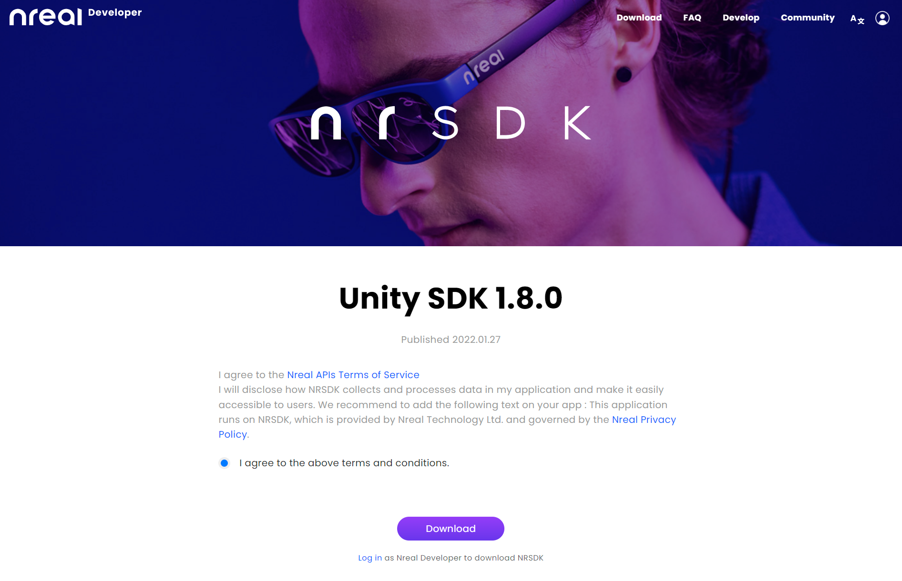
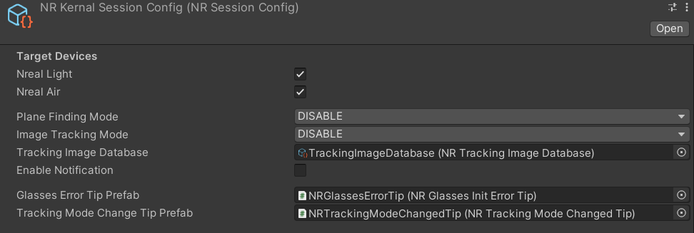

# Upgrading to NRSDK 1.8.0  - MR Tutorial for Nreal light

Until now, the tutorials have been based on NRSDK 1.7.0. Currently, the latest NRSDK version is 1.8.0. This section explains what you need to do to upgrade an old SDK. 

I also upgraded [HelloWorld tutorial](https://github.com/karad/mr-tutorials-for-nreal-light/tree/main/HelloWorld) while writing this explanation. I will be upgrading the other samples soon.

NRSDK version 1.8.0 and later have different documentation URLs. Check the following documents as well.

- [Learn Nreal Glasses - NRSDK](https://nreal.gitbook.io/nrsdk/discover/readme)

First, download NRSDK 1.8.0 from the following link.

- [Download | Nreal](https://developer.nreal.ai/download)

## How to Upgrade

1. Display `Project` > `Assets`, right click on `NRSDK` to show the context menu.
2. Select `Delete` for deleting Old NRSDK.
3. Right-click on `Assets` to display the context menu, then select `Import Package` > `Custom Package...`.
4. Select the `NRSDKForUnityAndroid_1.8.0.unitypackage` you have downloaded from the file dialog.
5. Please follow the usual dialog instructions.

After performing this upgrade, you can build your project to build an executable `.apk` on Nreal Air.

If it does not work on your Nreal Air device, select `NRCameraRig`, open the `Inspector` panel and go to `NR Session Behaviour` > `Session Config`.

Check that `Target Devices` is checked for both `Nreal Light` and `Nreal Air`.

Enjoy the new version of the NRSDK!