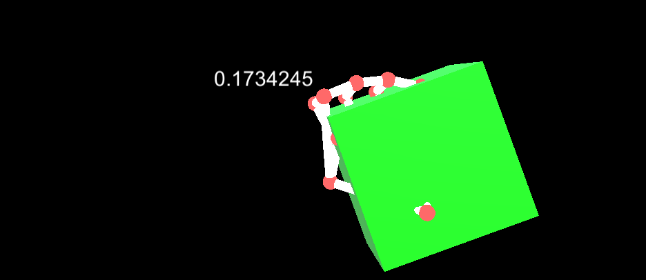

# Rotator - MR Tutorial for Nreal Light



Next, let's rotate the GameObject touched around the palm of your right hand. This tutorial is a continuation of the "Hold Me Tight" tutorial. If you have not yet comple "Hold Me Tight", please proceed with the following tutorial first.

- [mr-tutorials-for-nreal-light/HoldMeTight](https://github.com/karad/mr-tutorials-for-nreal-light/tree/main/HoldMeTight)

## Sample Repository

- mr-tutorials-for-nreal-light/Rotator at main · karad/mr-tutorials-for-nreal-light https://github.com/karad/mr-tutorials-for-nreal-light/tree/main/Rotator

## Run the sample

1. Clone Sample Repository, Change current directory to `Rotator`. And Open with Unity.
2. (If you don’t have NRSDK) Download NRSDK 1.7.0 from [https://nreal-public.nreal.ai/download/NRSDKForUnityAndroid_1.7.0.unitypackage](https://nreal-public.nreal.ai/download/NRSDKForUnityAndroid_1.7.0.unitypackage)
3. Open `Build Setting`, change Platform to `Android`
4. Open `Project`, select `Assets` > `import package` > `Custom Package` and import `NRSDKForUnityAndroid_1.7.0.unitypackage`.
5. Check `Build Settings` > `Player Settings` by referring to [Configure Build Settings](https://nreal.gitbook.io/nrsdk-documentation/discover/quickstart-for-android#configure-build-settings)
6. Press `Build` form `Build Settings` panel
7. Install *.apk on Android or DevKit.

## Tutorial

### 1. Place the TargetCube a little closer

1. Select `TargetCube1` from `Hierarchy` > `Target` 
2. Change `Pos z` to 0.6

### 2. Change C# script TargetCube.cs

Modify the C# script to reflect the right hand rotation on the TargetCube. Change the `TargetCube.cs` code as follows.

```csharp
using NRKernal;
using System.Collections;
using System.Collections.Generic;
using UnityEngine;
using UnityEngine.EventSystems;
using UnityEngine.UI;

/// <summary>
/// Target Cube Script
/// </summary>
public class TargetCube : MonoBehaviour
{
    private MeshRenderer meshRender;

    void Awake()
    {
        // Get mesh renderer
        meshRender = transform.GetComponent<MeshRenderer>();
    }

    // Start is called before the first frame update
    void Start()
    {
    }

    // Update is called once per frame
    void Update()
    {

    }

    /// <summary>
    /// Trigger Enter Event Handler
    /// </summary>
    /// <param name="other"></param>
    private void OnTriggerEnter(Collider other)
    {
        Debug.Log("Enter!");
        meshRender.material.color = new Color(0f, 1f, 0f);
    }

    /// <summary>
    /// Trigger Stay Event Handler
    /// </summary>
    /// <param name="other"></param>
    private void OnTriggerStay(Collider other)
    {
        // Get right hand rotation value
        HandState handState = NRInput.Hands.GetHandState(HandEnum.RightHand);
        Quaternion handStateThumbTipRotation = handState.GetJointPose(HandJointID.Palm).rotation;
        Quaternion targetRotation = transform.rotation;
        targetRotation.z = handStateThumbTipRotation.z;
        transform.rotation = targetRotation;
    }

    /// <summary>
    /// Trigger Exit Event Handler
    /// </summary>
    /// <param name="other"></param>
    private void OnTriggerExit(Collider other)
    {
        Debug.Log("Exit!");
        meshRender.material.color = new Color(1f, 1f, 1f);
    }
}
```

### 3. Change C# script HandController.cs

Next, let's also modify the right hand controller. Change the touch point from index finger to palm. Change the `HandController.cs` code as follows.

```csharp
using NRKernal;
using System.Collections;
using System.Collections.Generic;
using UnityEngine;

/// <summary>
/// Hand Controller for Tip
/// </summary>
public class HandController : MonoBehaviour
{
    /// <summary>
    /// IndexTip GameObject
    /// </summary>
    public GameObject hand_R_IndexTip;

    // Start is called before the first frame update
    void Start()
    {

    }

    // Update is called once per frame
    void Update()
    {
        // Get Right Hand
        HandState handState = NRInput.Hands.GetHandState(HandEnum.RightHand);
        // Get Index Tip Position of right hand
        Vector3 handStatePalmPosition = handState.GetJointPose(HandJointID.Palm).position;
        // Set Hand R IndexTip Sphere position
        hand_R_IndexTip.transform.position = handStatePalmPosition;
    }
}
```

### 4. Create a display area for rotation value

Let's also create a display area to get a numerical value for the right hand rotation value. Create `C# Script` in the asset with the file name "DisplayInfo.cs". Write the code as follows.

```csharp
using NRKernal;
using System.Collections;
using System.Collections.Generic;
using UnityEngine;
using UnityEngine.UI;

/// <summary>
/// Display about user actions
/// </summary>
public class DisplayInfo : MonoBehaviour
{
    /// <summary>
    /// 
    /// </summary>
    public Text info;

    // Start is called before the first frame update
    void Start()
    {
        
    }

    // Update is called once per frame
    void Update()
    {
        // Numeric display of right hand palm rotation value
        HandState handState = NRInput.Hands.GetHandState(HandEnum.RightHand);
        if (handState != null)
        {
            info.text = handState.GetJointPose(HandJointID.Palm).rotation.z.ToString();
        };
    }
}
```

### 5. Run the tutorial

- Press `Play` button and run the tutorial.

### 6. Build

1. Press `Build` form `Build Settings` panel
2. Install *.apk on Android or DevKit.