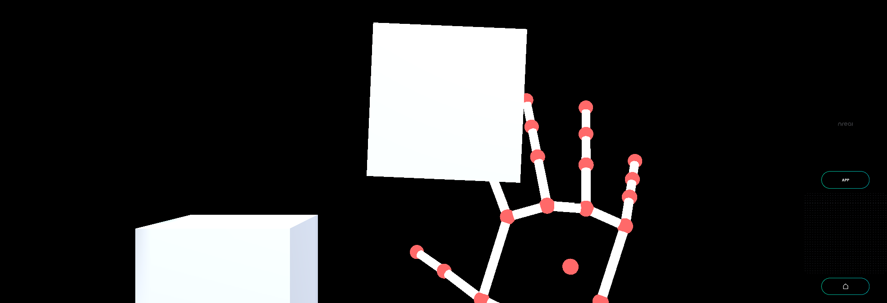

# U Can Touch This - MR Tutorial for Nreal light



Touch the object with the index finger of your right hand.

## Sample Repository

- 

## Run the sample

1. Clone Sample Repository, Change current directory to `UCanTouchThis`. And Open with Unity.
2. (If you don’t have NRSDK) Download NRSDK 1.7.0 from [https://nreal-public.nreal.ai/download/NRSDKForUnityAndroid_1.7.0.unitypackage](https://nreal-public.nreal.ai/download/NRSDKForUnityAndroid_1.7.0.unitypackage)
3. Open `Build Setting`, change Platform to `Android`
4. Open `Project`, select `Assets` > `import package` > `Custom Package` and import `NRSDKForUnityAndroid_1.7.0.unitypackage`.
5. Check `Build Settings` > `Player Settings` by referring to [Configure Build Settings](https://nreal.gitbook.io/nrsdk-documentation/discover/quickstart-for-android#configure-build-settings)
6. Press `Build` form `Build Settings` panel
7. Install *.apk on Android or DevKit.

## Tutorial

### 1. Setting up the project for Nreal development

1. See [Quickstart for Android - NRSDK Documentation](https://nreal.gitbook.io/nrsdk-documentation/discover/quickstart-for-android#configure-build-settings) and configure the build settings.
2. (If you don’t have NRSDK) Download NRSDK 1.7.0 from [https://nreal-public.nreal.ai/download/NRSDKForUnityAndroid_1.7.0.unitypackage](https://nreal-public.nreal.ai/download/NRSDKForUnityAndroid_1.7.0.unitypackage)
3. Open `Project`, select `Assets` > `import package` > `Custom Package` and import `NRSDKForUnityAndroid_1.7.0.unitypackage`.

### 2. Setting for HandTracking to NRInput

1. Select `NRInput` , and change `Input Source Type` to `Hands`
2. Put `NRHand_R` from `Assets` > `NRSDK` > `Prefabs` > `Hands` to `NRInput` > `Right` on the Scene.
3. Put `NRHand_L` from `Assets` > `NRSDK` > `Prefabs` > `Hands` to `NRInput` > `Left` on the Scene.

### 3. Disable NRHandPointer_R

1. Select `NRHandPointer_R` from `NRInput` > `Right` > `NRHand_R` on the Scene.
2. Disable `NRHandPointer_R` from Inspector Panel.
3. Do the same settings for the Left hand (`NRHandPointer_L`) .

### 4. Create empty game objects

1. Create an empty game object in the Scene with the name "HandController".
2. Also, create an empty game object in the Scene with the name "Target".
3. Set each GameObject's positions to 0.
    1. `Pos X` : 0, `Pos Y` : 0, `Pos Z` : 0

### 5. Make Alpha material

1. Create Material on  `Assets` 
2. Change name to “AlphaMaterial”
3. Change `Rendering Mode` item to `Fade`.

### 6. Create Sphere for hand tracking

1. Put `Sphere` in `HandController`.
    1. Change name to “Hand_R_IndexTip”
    2. `Pos X` : 0, `Pos Y` : 0, `Pos Z` : 0
    3. `Scale`
        1. `X` : 0.03 , `Y` : 0.03 , `Z` : 0.03
    4. Add component `Ridgitbody` .
        1. Uncheck `Use Gravity`
    5. Set a material “AlphaMaterial” to `Materials` from `Assets`.

### 7. Create C# script for hand tracking extension

1. Create `C# Script` in the asset with the file name "HandController.cs".
2. Write the code as follows.

```csharp
using NRKernal;
using System.Collections;
using System.Collections.Generic;
using UnityEngine;

/// <summary>
/// Hand Controller for Tip
/// </summary>
public class HandController : MonoBehaviour
{
    /// <summary>
    /// IndexTip GameObject
    /// </summary>
    public GameObject hand_R_IndexTip;

    // Start is called before the first frame update
    void Start()
    {
    }

    // Update is called once per frame
    void Update()
    {
        // Get Right Hand
        HandState handState = NRInput.Hands.GetHandState(HandEnum.RightHand);
        // Get Index Tip Position of right hand
        Vector3 handStateThumbTipPosition = handState.GetJointPose(HandJointID.IndexTip).position;
        // Set Hand R IndexTip Sphere position
        hand_R_IndexTip.transform.position = handStateThumbTipPosition;
    }
}
```

### 8. Attach the C# script on “HandController”

1. Attach "HandController.cs" to “HandController” game object
    1. Set `hand_R_IndexTip` on `Inspector` panel to “Hand_R_IndexTip” game object from the scene.

### 9. Create Cube as a target object

1. Put `Sphere` in `Target`.
    1. Change name to “TargetCube1”
    2. `Pos X` : 0.1, `Pos Y` : -0.05, `Pos Z` : 0.8
    3. `Scale`
        1. `X` : 0.1 , `Y` : 0.1 , `Z` : 0.1
    4. Add component `Ridgitbody` .
        1. Uncheck `Use Gravity`

### 10. Create C# script for target game object

1. Create `C# Script` in the asset with the file name "TargetCube.cs".
2. Write the code as follows.

```csharp
using NRKernal;
using System.Collections;
using System.Collections.Generic;
using UnityEngine;
using UnityEngine.EventSystems;
using UnityEngine.UI;

/// <summary>
/// Target Cube Script
/// </summary>
public class TargetCube: MonoBehaviour
{
    // Start is called before the first frame update
    void Start()
    {
    }

    // Update is called once per frame
    void Update()
    {
    }

    /// <summary>
    /// Display event log using console
    /// </summary>
    /// <param name="collision"></param>
    void OnCollisionEnter(Collision collision)
    {
        Debug.Log("Hit!");
    }
}
```

### 11. Attach the C# script on “Target”

1. Attach "TargetCube.cs" to “TargetCube1” game object.

### 12. Build

1. Press `Build` form `Build Settings` panel
2. Install *.apk on Android or DevKit.